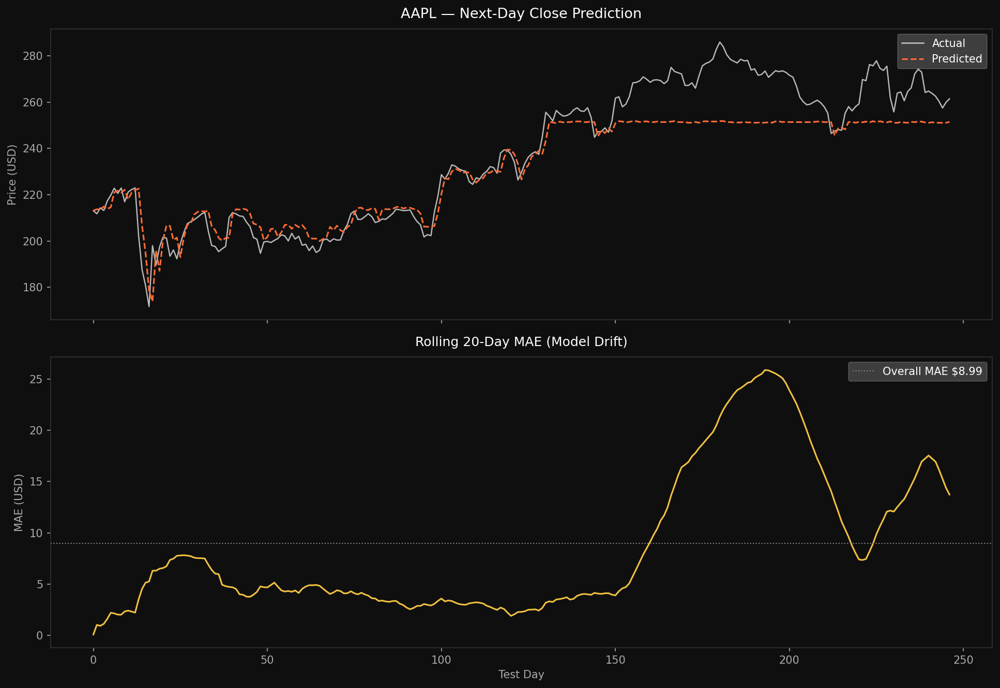
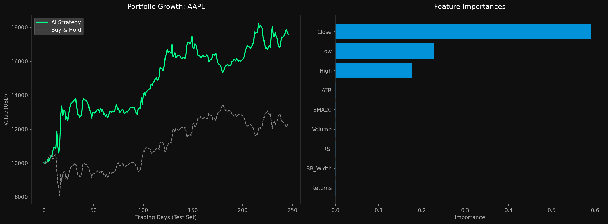

# Stock Price Predictor & Trading System

A machine learning pipeline that downloads historical OHLCV data via `yfinance`, engineers technical indicators, trains a Random Forest model to forecast next-day close prices, and simulates a long/short trading strategy against a buy-and-hold benchmark.  
## Editions  
### First edition  
THere are "errors" in the model, not utilizing all the params available to it.  
Predictions are based on random forests, meaning it wont predict past the ATH it observed in the training set, thats why the curve is flattening.  

---

## Project Structure

```
├── stock_model.py        # Feature engineering & data preparation
├── trading_system.py     # Strategy engine, metrics, equity simulation
├── trading_model.py          # Price prediction visualisation & rolling MAE
```

---

## How It Works

**`stock_model.py`** downloads 5 years of daily OHLCV data and constructs a 9-feature matrix:

| # | Feature | Description |
|---|---------|-------------|
| 1 | Close | Closing price |
| 2 | High | Daily high |
| 3 | Low | Daily low |
| 4 | Volume | Share volume |
| 5 | SMA20 | 20-day simple moving average (causal, no look-ahead) |
| 6 | RSI | 14-period Wilder RSI |
| 7 | Returns | Daily log return |
| 8 | BB_Width | Normalised Bollinger Band width (volatility proxy) |
| 9 | ATR | 14-period Average True Range |

Row `t` of `X` contains indicators known at the close of day `t`; `y[t]` is the close price of day `t+1`. The first 20 warmup rows are dropped to ensure indicator reliability.

**`trading_system.py`** splits data 80/20 chronologically, fits a `RandomForestRegressor`, and generates signals:

- `+1` (long) when predicted price > current price  
- `−1` (short) when predicted price < current price  

Strategy and benchmark equity curves are computed, along with Sharpe ratio, max drawdown, and win rate.

**`predictor.py`** plots actual vs predicted prices and a rolling 20-day MAE to surface model drift over time.

---

## Outputs

### Price Prediction & Model Drift

`main.py` produces a two-panel chart:

- **Top**: Actual next-day close (white) vs model predictions (orange dashed)
- **Bottom**: Rolling 20-day MAE (yellow) and the overall MAE baseline (grey dotted) — rising MAE indicates the model is losing predictive accuracy in that window



---

### Portfolio Growth & Feature Importances

`trading_model.py` produces a two-panel chart:

- **Left**: Strategy equity curve (green) vs buy-and-hold benchmark (grey dashed), both starting from `$10,000`
- **Right**: Random Forest feature importances — which indicators drove predictions most



---

## Quickstart

```bash
pip install yfinance scikit-learn numpy matplotlib
```

Run the predictor:
```bash
python predictor.py
```

Run the full trading system:
```bash
python trading_model.py
```

Change the ticker or starting capital by editing the `__main__` block in either file, or by importing directly:

```python
from trading_model import run_trading_system, visualize_performance

results = run_trading_system("TSLA", initial_capital=25_000)
visualize_performance(*results, "TSLA")
```

---

## Example Metrics Output

```
==========================================
  AAPL Trading System Results
==========================================
  MAE (price prediction)  : $2.47
  Strategy total return   : +34.12%
  Benchmark total return  : +21.85%
  Sharpe ratio            : 1.43
  Max drawdown            : -12.30%
  Win rate                : 54.2%
==========================================
```

---

## Caveats

This is a research prototype, not financial advice. The model uses only price-derived features and does not account for transaction costs, slippage, or market impact. Past simulated performance is not indicative of future results.
